# Flask

Flask是一个用于web开发的微型框架，它具有一个包含基本服务的核心，其他功能可以通过扩展实现。

Flask有三个依赖：路由，调试，和web服务器网关接口。


# 虚拟环境

虚拟环境是python解释器的一个私有副本，可以避免安装的Python版本与系统预装的发生冲突，为每个项目单独创建虚拟环境，可以保证应用只能访问虚拟环境中的包，从而保持全局解释器的干净整洁，并且不需要管理员权限。

vscode中需要安装第三方库帮助创建虚拟环境

```python
pip3 install virtualenv
```

创建虚拟环境

```python
virtualenv venvname 
```

选择解释器

```python
virtualenv -p D:\python311\python.exe  venvname
```

启动

```python
 venv\Scripts\activate
```

退出

```python
 deactivate
```


# 基本概念

## 域名

域名是网站的名字或地址，用于代替难记的IP地址

## 端口号

每台服务器可能同时多个服务(网页，邮件，数据库)，端口号用于指定具体的服务

## Session和cookie

HTTP请求是无状态协议，不保存状态

`session` 允许你**在不同的请求之间存储和共享数据**。它实际上存储在服务器端，但会通过一个 cookie 在客户端传递给浏览器。

通过 `session`，你可以在多个请求之间**持久化用户的状态和信息**，比如：用户名、登录状态、购物车数据等。

当客户发起第一次请求时，服务器会建立与客户端的会话并将会话的唯一标识符Session ID传送给客户，服务器口语将一些信息保存在会话中，当客户第二次发起请求时会携带Session ID到服务器中，服务器通过Session ID获取会话中的信息


## 跨域限制

跨域限制(同源策略)防止一个网站上的脚本与另一个不同来源上的资源进行不受限制的交互

不同的来源指的是协议（例如 http 或 https）、域名（例如 example.com）和端口号相同

- **同源：**
  - https://example.com/index.html 与 https://example.com/about.html
- **不同源：**
  - https://example.com 与 http://example.com（协议不同）
  - https://example.com 与 https://api.example.com（子域名不同）
  - https://example.com 与 https://example.com:8080（端口不同）


## CSRF

CSRF——跨站请求伪造，恶意网站通过已认证的用户浏览器在受信任站点上执行非正常操作，一般通过外部链接实现

 **CSRF防护机制**会基于secret_key生成token，服务器再生成页面时会给用户一个token，在提交时用户需要携带token一起，然后服务器会检查token是否正确，外部网站是无法访问网站页面的token。


# 应用基本结构

## 初始化

应用实例是整个网站的心脏，所有的请求都会有Flask实例处理

```python
from flask import Flask
app=Flask(__name__)
```


## 路由和视图函数

客户端把请求发送给web服务器，Web服务器再把请求发送给Flask应用实例，应用实例需要知道对每个URL请求去要运行那些代码，所以保存了一个URL到Python函数的映射关系，处理URL和函数之间关系的程序称为路由。

将index函数(视图函数)注册为根地址的处理程序，函数的放回置称为响应

```python
@app.route('/')
def index():
    return '<h1>Hello World!</h1>'
```


匹配URL中的参数部分，使用尖括号围起

```python
@app.route('/user/<name>')
def user(name):
    return f'<h1>Hello {name}!</h1>'
```


## 启动方式

终端输入

```python
set FLASK_APP=app.py # 入口
PS D:\vscodeProject\flask> flask run 
```


其他参数有

```python
--host=0.0.0.0	允许外部访问
--port=8080	指定端口（默认 5000）
--debug	开启调试模式（等价于设置 FLASK_ENV=development）
--reload	源码变更自动重启服务器
```


```python
flask run --host=0.0.0.0 --port=8080 --debug
```


这些参数可以在根目录下创建.flaskenv

```python
FLASK_APP=app.py            # 指定Flask入口文件
FLASK_ENV=development       # 设置运行环境：开发（development）或生产（production）
FLASK_DEBUG=1               # 是否开启调试模式（1 开启，0 关闭
```


使用前需安装插件

```python
pip install python-dotenv
```

再执行flask run时可以自动读取配置


## 上下文

Flask中的上下文能在处理请求时方便地访问应用相关的信息，而不需要单独传递到函数中。

上下文分为请求上下文和应用上下文

应用上下文绑定了Flask应用实例，能够在全局范围内访问应用相关的对象

+ current_app——当前正在处理请求的应用实例
+ g——在请求期间存储临时数据


请求上下文绑定了每一个HTTP请i去，确保每个请求可以访问当前请求的相关内容，比如请求的参数，头信息，cokkies

+ `request`—— 包含当前请求的所有信息，如请求方法（GET、POST）、请求数据、表单数据、URL 参数等
+ `session`: 用于在多个请求之间存储和读取用户的会话数据


视图函数中会自动推入上下文上下文，但是在单元测试/命令行脚本中需要手动加载上下文

```python
@app.route('/send')
def send_mail():
    # 创建邮件对象，第一个参数hi是标题，第二个参数是收件人列表
    msg = Message('Hello from Flask',
                  recipients=['2228632512@qq.com'])
    # 设置邮件内容
    msg.body = 'This is a test message sent from Flask-Mail.'
    msg.html = '<b>This is a test message sent from Flask-Mail.</b>'
    
    # 创建上下文，访问到配置信息
    with app.app_context():
        # 发送邮件
        mail.send(msg)
    return '邮件发送成功！'
```


## 请求钩子

请求钩子是在请求生命周期中的某些阶段执行的函数

+ before_request 在每次请求之前运行。
+ before_first_request 尽在处理第一个请求函数之前执行
+ after_request 请求成功执行之后执行
+ teardown_request 不管请求是否成功运行都执行


## 响应

视图函数默认返回状态码200，也可以手动设置

```python
@app.route('/not_found')
def not_found():
    return 'Page not found', 404  # 返回 404 状态码
```

还可以返回第三个参数——由HTTP响应首部组成的字典


如果不想返回元组则可以使用Response对象

```python
from flask import make_response
@app.route('/')
def index():
 response = make_response('<h1>This document carries a cookie!</h1>')
 response.set_cookie('answer', '42')
 return response
```

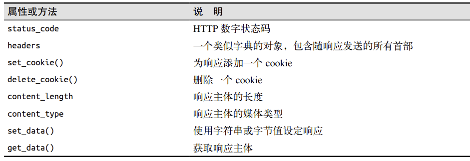


响应的一种特殊类型是重定向

```python
from flask import redirect
@app.route('/')
def index():
 return redirect('http://www.example.com')
```


# 模板

## Jinja2

Jinja2用于将python中的数据和逻辑渲染到HTML(txt也可以)模板中


变量输出

```python
<h1>Welcome, {{ user.name }}!</h1>
```


条件语句

```python

    <h1>Admin Dashboard</h1>

    <h1>User Dashboard</h1>

```


循环

```python
<ul>

    <li>{{ item }}</li>

</ul>
```


过滤器

```python
<p>{{ name|capitalize }}</p>
<p>{{ description|length }}</p>
```

`capitalize` 会将字符串的首字母大写，`length` 会返回字符串的长度。


模板进程

在base.html中放置block，block的名称自定义

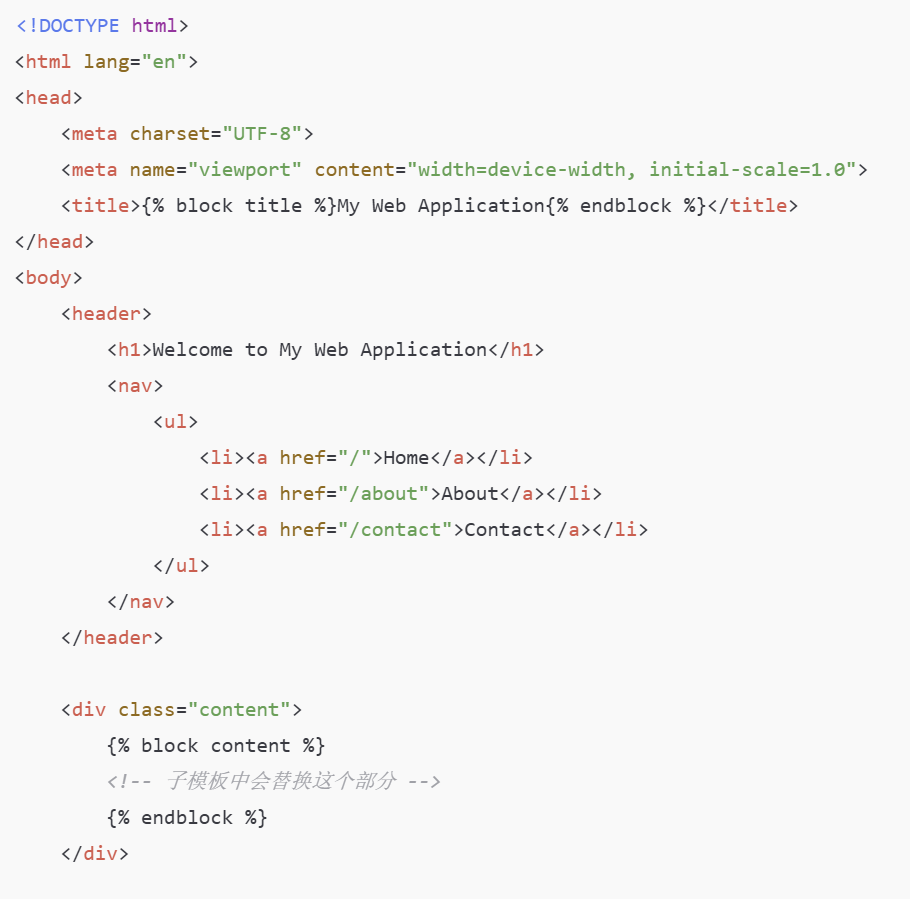


在index.html中继承base.tml，覆写block

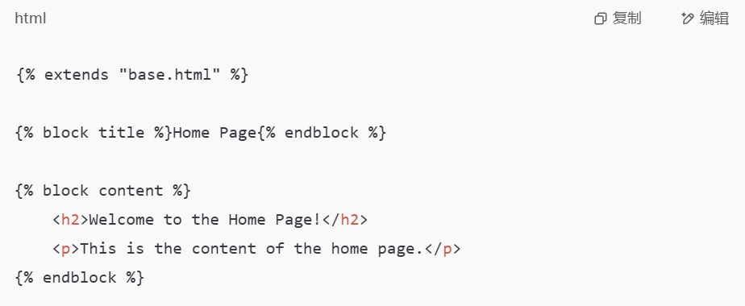

最后通过render_template渲染同时传入参数

```python
return render_template('index.html', name=name)
```

render_template默认从templates文件夹下寻找内容


如果父模板的block原本就有内容并且子模版想要追加而不是覆写，就需要使用super()

base.html

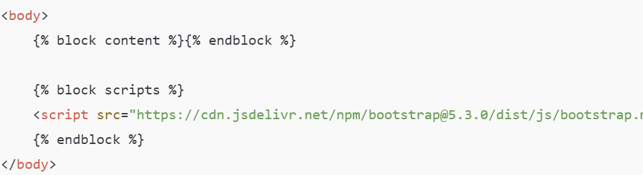


child.html

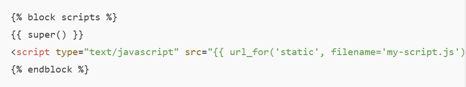


## 自定义错误页面

@app.errorhandler是用来处理特定HTTP错误的装饰器

```python
@app.errorhandler(404)
def page_npot_found(e):
    return render_template('404.html'),404

@app.errorhandler(500)
def internal_server_error(e):
    return render_template('500.html'),500
```


## 链接

url_for()接受视图函数的名称，返回对应的url

```python
url_for('index') # 返回/
url_for('index', _external=True) # 返回 _external返回绝对路径
url_for('user', name='John') # 接收参数，返回/user/John
url_for('user', name='john', page=2, version=1) # 不仅限于动态路由中的参数，/user/john?page=2&version=1
```


另一种应用是生成静态文件的URL

```python

{{super()}}
<link rel="shortcut icon" href="{{ url_for('static', filename='favicon.ico') }}" type="image/x-icon">
<link rel="icon" href="{{ url_for('static', filename='favicon.ico') }}" type="image/x-icon">

```


## 日期和时间

web的用户可能来自世界各地，因此服务器需要统一处理时间


安装外部库

```python
pip install flask-moment
```


需要在模板中导入，注意scripts标签要放到最顶部

```python

{{ super() }}
{{ moment.include_moment()}} # Flask-Momen提供的自动插入Moment.js的<script>标签的函数
{{moment.locale('zh-cn')}} # 设置中文

```


作为参数传入

```python
from datetime import datetime,timezone
from flask_moment import Moment
moment=Moment(app)
@app.route('/')
def index():
    return render_template('base.html',current_time=datetime.now(timezone.utc))
```


模板中添加

```html
<p>The local date and time is {{ moment(current_time).format('LLL') }}.</p>
<p>That was {{ moment(current_time).fromNow(refresh=True) }}</p>
```


+ moment().format('YYYY-MM-DD HH:mm:ss')格式化日期 常见格式有`'LLL'`：Apr 11, 2025 9:08 PM

  `'LLLL'`：Friday, April 11, 2025 9:08 PM

+ moment().fromNow 显示相对时间 refresh设置刷新

+ moment().from() 和指定时间比较

+ moment(current_time).calendar() 日历格式 ——Today at 9:08 PM


# Web表单

处理表单所需的库

```python
pip install flask-wtf
```


 Flask-WTF 默认启用了 **CSRF防护机制**，需要给secret_key来加密，生成令牌

```python
import os 
app.secret_key=os.urandom(24)
```


## 表单类

表单类继承FlaskForm基类，其中每个字段代表一个表单项

```python
from flask_wtf import FlaskForm
from wtforms import StringField,SubmitField # 文本框，提交按钮
from wtforms.validators import DataRequired # 验证器，确保输入不为空

class NameForm(FlaskForm):
    # validators指定一个有验证函数组成的列表 第一个参数为label——表单中显示的标签文字
    name=StringField('What is your name?', validators=[DataRequired()])
    submit=SubmitField('Submit')
    
from wtforms.validators import Email 
class InfoForm(FlaskForm):
    username = StringField('Username', validators=[DataRequired()])
    email = StringField('Email', validators=[DataRequired(), Email()])
    submit = SubmitField('Submit')
```


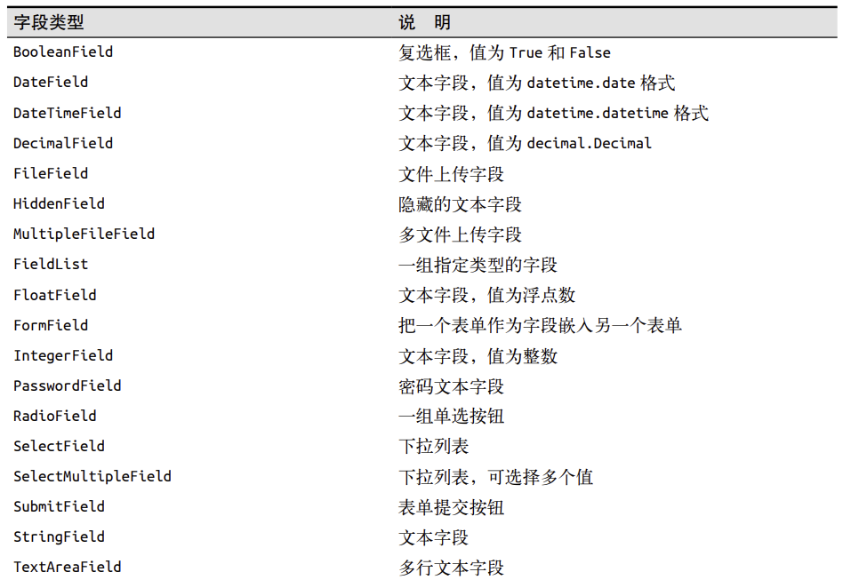


验证函数

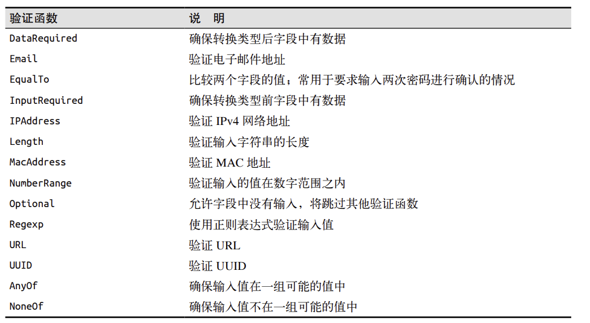


## 表单渲染为HTML

通过视图函数传入form参数(表单对象)

```html 
<form method="POST">
 {{ form.hidden_tag() }}   防护机制使用
 {{ form.name.label }} {{ form.name() }}  # 文本框
 {{ form.submit() }} #  提交按钮
</form>
```


或者使用Bootstrap的表单样式，传入form快速渲染

```python

{{ wtf.quick_form(form) }}
```


validate_on_submit会判断当前是不是POST请求，以及表单是否通过过了验证器

```python
@app.route('/',methods=['GET','POST'])
def index():
    name=None
    form=NameForm()
    if form.validate_on_submit():
        name=form.name.data
        form.name.data=''
    return render_template('index.html',form=form,name=name,current_time=datetime.now(timezone.utc))

```


## 重定向


表单提交后再次刷新浏览器会重复提交表单，浏览器会出现警告

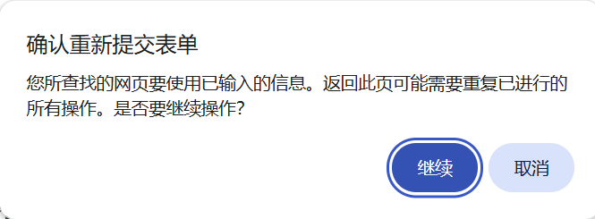


因此对于POST操作，使用重定向作为请求的响应，但是由于HTTP协议是无状态的，即每个请求和响应都是独立的，服务器无法记住不同请求的数据，所以需要session储存数据


## 闪现消息

有时请求完成后需要让用户知道状态发生了变化，可以通过Flask内置的flash()实现，同时还要使用get_flashed_messages()渲染页面

```python
from flask import Flask,render_template,session,redirect,url_for,flash
@app.route('/',methods=['GET','POST'])
def index():
    form=NameForm()
    if form.validate_on_submit():
        preName=session.get('name')
        if preName and preName!=form.name.data:
            flash('Looks like you have changed your name!')
        session['name']=form.name.data
        return redirect(url_for("index"))
    return render_template('index.html',form=form,name=session.get('name'),current_time=datetime.now(timezone.utc))

```


渲染

```python

<div class="container">
    
    <div class="'alert alert_warning">
        <button type="button" class="close" data-dismiss="alert">&times;</button>
        {{message}}
    </div>
    
    
</div>

```

# 数据库

SQLAlchemy是pyhton中最流行的ORM框架，ORM框架指对象关系映射，将数据库表结构映射为python类。

flask_sqlalchemy是一个在flask项目中使用SQLAlchemy更便捷的扩展


## 初始化

flask中选用SQLite数据库，**SQLite** 是一个轻量级的嵌入式的关系型数据库，它不需要独立的数据库服务器，所有的数据都保存在一个本地文件中，它是“零配置”的数据库 —— 安装 Python 后就可以直接使用。

初始化

```python
basedir = os.path.abspath(os.path.dirname(__file__)) # 获取当前程序的目录
app.config['SQLALCHEMY_DATABASE_URI'] =\
 'sqlite:///' + os.path.join(basedir, 'data.sqlite')# 配置数据库
app.config['SQLALCHEMY_TRACK_MODIFICATIONS'] = False # 不储存对象的修改信息
db = SQLAlchemy(app)# 创建数据库实例
```


## 定义模型

继承基类

```python
class Role(db.Model):
    __tablename__='roles' # 表名
    id=db.Column(db.Integer,primary_key=True) # 属性
    name=db.Column(db.String(64),unique=True)

    # 建立一对多关系 backref指定在User表中添加role对象 lazy设置查询返回的结果还可以继续查询
    users = db.relationship('User', backref='role', lazy='dynamic')


    # 用于表示对象的字符串方法
    def __repr__(self):
        return '<Role %r>'%self.name

class User(db.Model):
    __tablename__='User' # 表名
    id=db.Column(db.Integer,primary_key=True) # 属性
    username=db.Column(db.String(64),unique=True,index=True)

    # 创建外键引用 roles指的是表名
    role_id=db.Column(db.Integer,db.ForeignKey('roles.id'))

    # 用于表示对象的字符串方法
    def __repr__(self):
        return '<Role %r>'%self.username
```


常用的列选项

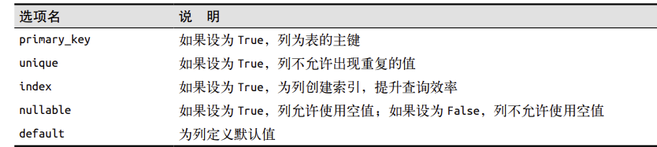


## 数据库操作

操作可以在flask shell中进行(避免代码重复执行)，使用exit()退出shell 

### 创建表

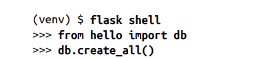

### 插入行

先创建

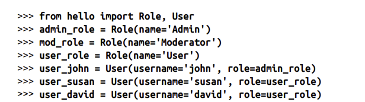

再插入


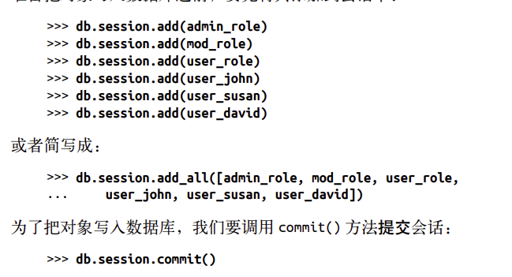

### 修改行

修改后重新提交

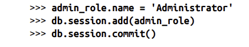

### 删除行


### 查询行

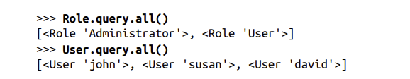

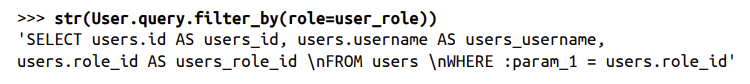

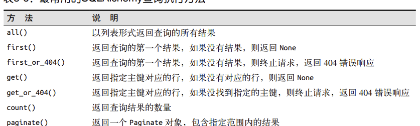


## 集成python shell

避免重复导入数据库实例与模型，可以预先配置shell

```python
# 自定义shell启动时自动导入的变量
@app.shell_context_processor
def make_shell_context():
 return dict(db=db, User=User, Role=Role)
```


## 数据迁移

在开发的过程中有时需要修改数据库模型，并且修改后还要更新数据库。

仅当数据库表不存在时，Flask-SQLAlchemy才会更根据模型创建，因此更新表的方式就是先删除旧表，但是这样会丢失数据库一种的全部数据。

另一种更新表的方式是使用数据库与迁移框架

```python
pip install flask-migrate
```


初始化

```python
from flask_migrate import Migrate
migrate=Migrate(app,db)
```

flask db init


操作方式类似于git

对模型做修改，执行flask db migrate命令flask db migrate -m "initial migration"

把改动应用到数据库 flask db upgrade

撤销上一次改动flask db downgrade，可能会导致数据丢失


# 电子邮件

## 初始化

电子邮件服务由Flask-Mail 扩展提供，使用SMTP协议将邮件交给服务器发送

```python
pip install flask-mail
```


配置，使用QQ服务器

```python
from flask_mail import Mail

# 配置邮箱服务器信息
app.config['MAIL_SERVER'] = 'smtp.qq.com'               # 邮件服务器，比如QQ邮箱
app.config['MAIL_PORT'] = 465                           # SSL端口号
app.config['MAIL_USE_SSL'] = True                       # 使用SSL
app.config['MAIL_USERNAME'] = os.environ.get('MAIL_USERNAME')           # 发件人邮箱
app.config['MAIL_PASSWORD'] = os.environ.get('MAIL_PASSWORD')   	    # 授权码  

也可以自定设置一些键值对比如标题前缀...

mail=Mail(app) # 注意配置写到初始化前面
```

邮箱授权码等不应直接写入代码，可以放置到环境变量中再读取


QQ邮箱获取授权码方法如下


## 示例

发送邮件示例

```python
def send_mail(to,subject,template,**kwargs):
    # 创建邮件对象，第一个是标题，sender发件人，recipients收件人列表
    msg = Message(app.config['FLASKY_MAIL_SUBJECT_PREFIX']+subject,
                  sender=app.config['FLASKY_MAIL_SENDER'],recipients=[to])
    # 渲染文本和HTML内容
    msg.body=render_template(template+'.txt',**kwargs)
    msg.html=render_template(template+'.html',**kwargs)
    mail.send(msg)
```


## 异步发送

网页如果不使用异步发送邮件，那么调用mail.send()时会卡住直到邮件发送完成

```python
def send_async_email(app,msg):
    with app.app_context():
        mail.send(msg)

def send_email(to, subject, template, **kwargs):
    msg = Message(app.config['FLASKY_MAIL_SUBJECT_PREFIX'] + subject,
    sender=app.config['FLASKY_MAIL_SENDER'], recipients=[to])
    msg.body = render_template(template + '.txt', **kwargs)
    msg.html = render_template(template + '.html', **kwargs)
    tr=Thread(target=send_async_email,args=[app,msg])
    tr.start()
    return tr
```


# 项目结构


## config.py

config.py是一个Python配置文件，用于集中管理应用程序的不同环境

```python
import os 

basedir=os.path.abspath(os.path.dirname(__file__))

# 配置基类
class Config:
    SECRET_KEY = os.environ.get('SECRET_KEY') or os.urandom(24)# 设置密钥
    SQLALCHEMY_TRACK_MODIFICATIONS = False                     # 不追踪数据库修改


    '''邮件设置 以QQ邮件服务器为例'''
    MAIL_SERVER='smtp.qq.com'   # SMTP服务器
    MAIL_PORT=465
    MAIL_USE_SSL=True
    MAIL_USERNAME=os.environ.get('MAIL_USERNAME')  # 凑够环境变量中取得
    MAIL_PASSWORD=os.environ.get('MAIL_PASSWORD') 
    MAIL_DEFAULT_SENDER = '2228632512@qq.com'   # 默认发送者
    FLASKY_MAIL_SUBJECT_PREFIX = '[Flasky]' # 前缀
    FLASKY_MAIL_SENDER = 'Flasky Admin <2228632512@qq.com>' # 发送者


    '''数据库设置'''
    SQLALCHEMY_DATABASE_URI='sqlite:///' + os.path.join(basedir, 'data.sqlite')

    # 
    @staticmethod
    def init_app(app):
        """可选：在应用创建后执行额外的初始化"""
        pass  # 默认不执行任何操作
# 下面是几个子类

'''
开发环境，启用调试模式
'''
class DevelopmentConfig(Config):
    DEBUG = True  # 开启调试模式

'''
测试环境，使用内容数据库
'''
class TestingConfig(Config):
    TESTING = True  # 启用测试模式
    SQLALCHEMY_DATABASE_URI = 'sqlite:///:memory:'  # 使用内存数据库


'''
生产环境，关闭调试模式
'''
class ProductionConfig(Config):
    DEBUG = False  # 关闭调试模式

# 配置字典
config = {
 'development': DevelopmentConfig,
 'testing': TestingConfig,
 'production': ProductionConfig,
 'default': DevelopmentConfig
}
```


在主程序中加载配置

```python
from flask import Flask
from config import config  # 导入 config 字典

app = Flask(__name__)

app.config.from_object(config['default'])
```


## 应用包

应用包存放应用的所有代码，模板静态文件(templates，statics)

在单个文件中开发应用很方便，但是应用在全局作用域创建无法动态修改配置，而在测试中需要使用不同的配置，使用应用工厂函数可以延迟创建实例，在创建前自由修改配置

```python
from flask import Flask,render_template
from flask_bootstrap import Bootstrap
from flask_mail import Mail
from flask_moment import Moment
from config import config
from flask_sqlalchemy import SQLAlchemy
from flask import Bluuprint

bootstrap=Bootstrap()
mail=Mail()
moment=Moment()
db=SQLAlchemy()
main=Bluuprint('main',__name__)

def create_app(config_name):
    app=Flask(__name__)
    app.config.from_object(config[config_name])
    config[config_name].init_app(app)

    bootstrap.init_app(app)
    mail.init_app(app)
    moment.init_app(app)
    db.init_app(app)

    '''
    添加路由和自定义的错误页面
    '''

    return app 
```


转换为应用工厂函数的操作让定义路由变得复杂了，在单脚本应用中，实例存在于全局作用域中，路由可以直接使用装饰器定义，但是用了应用工厂函数后，实例在运行时创建，只有在调用create_app后才能用装饰器定义路由，这样就太晚了。

而蓝图可以解决这个问题，蓝图定义的路由和错误处理程序处于休眠状态，等主程序调用 `create_app()` 时再把这些函数“注册”上去

主蓝本(app/main/\__init__.py)

```python
from flask import Blueprint

# 第一个参数是蓝图的名称，第二个参数是蓝图所在的包
main=Blueprint('main',__name__)

# 能把路由和错误处理程序与蓝图关联起来，但是要在最后导入防止循环依赖
from . import views,errors # 相对导入
```

注册主蓝本

```python
def create_app(config_name):
    app=Flask(__name__)
    app.config.from_object(config[config_name])
    config[config_name].init_app(app)

    bootstrap.init_app(app)
    mail.init_app(app)
    moment.init_app(app)
    db.init_app(app)

    '''
    添加路由和自定义的错误页面
    '''
    from .main import main as main_blueprint
    app.register_blueprint(main_blueprint)
    return app 
```


错误处理程序(app/main/errors.py)

```python
from flask import render_template
from . import main

@main.app_errorhandler(404)
def page_not_found(e):
    return render_template('404.html'),404


@main.app_errorhandler(500)
def internal_server_error(e):
    return render_template('500.html'),500
```


视图函数app/main/views.py，修改路由装饰器app.route->main.route，实例修改为app->current_app，url_for参数index->main.index即主蓝图的名称

```python
@main.route('/',methods=['GET','POST'])
def index():
    form=NameForm()
    if form.validate_on_submit():
        user = User.query.filter_by(username=form.name.data).first()
        if user is None:
            user = User(username=form.name.data)
            db.session.add(user)
            session['known'] = False
            if current_app.config['MAIL_USERNAME']:
                send_email(current_app.config['MAIL_USERNAME'], 'New User',
        'email', user=user)
        else:
            session['known']=True
        session['name']=form.name.data
        form.name.data=''
        return redirect(url_for('index'))
    return render_template('index.html',form=form,name=session.get('name'),current_time=datetime.now(timezone.utc))

```


## 实例

```python
import os
from app import create_app,db
from app.models import User,Role
from flask import Migrate

app=create_app('default')
migrate=Migrate()

@app.shell_context_processor
def make_shell_context():
    return dict(db=db,User=User,Role=Role)
```


## 生成需求文件

```python
 pip freeze >requirements.txt
```

