# Flask

Flask是一个用于web开发的微型框架，它具有一个包含基本服务的核心，其他功能可以通过扩展实现。

Flask有三个依赖：路由，调试，和web服务器网关接口。


# 虚拟环境

虚拟环境是python解释器的一个私有副本，可以避免安装的Python版本与系统预装的发生冲突，为每个项目单独创建虚拟环境，可以保证应用只能访问虚拟环境中的包，从而保持全局解释器的干净整洁，并且不需要管理员权限。

vscode中需要安装第三方库帮助创建虚拟环境

```python
pip3 install virtualenv
```

创建虚拟环境

```python
virtualenv venvname 
```

选择解释器

```python
virtualenv -p D:\python311\python.exe  venvname
```

启动

```python
 venv\Scripts\activate
```

退出

```python
 deactivate
```


# 基本概念

## 域名

域名是网站的名字或地址，用于代替难记的IP地址

## 端口号

每台服务器可能同时多个服务(网页，邮件，数据库)，端口号用于指定具体的服务

## Session和cookie

HTTP请求是无状态协议，不保存状态

`session` 允许你**在不同的请求之间存储和共享数据**。它实际上存储在服务器端，但会通过一个 cookie 在客户端传递给浏览器。

通过 `session`，你可以在多个请求之间**持久化用户的状态和信息**，比如：用户名、登录状态、购物车数据等。

当客户发起第一次请求时，服务器会建立与客户端的会话并将会话的唯一标识符Session ID传送给客户，服务器口语将一些信息保存在会话中，当客户第二次发起请求时会携带Session ID到服务器中，服务器通过Session ID获取会话中的信息


## 跨域限制

跨域限制(同源策略)防止一个网站上的脚本与另一个不同来源上的资源进行不受限制的交互

不同的来源指的是协议（例如 http 或 https）、域名（例如 example.com）和端口号相同

- **同源：**
  - https://example.com/index.html 与 https://example.com/about.html
- **不同源：**
  - https://example.com 与 http://example.com（协议不同）
  - https://example.com 与 https://api.example.com（子域名不同）
  - https://example.com 与 https://example.com:8080（端口不同）


## CSRF

CSRF——跨站请求伪造，恶意网站通过已认证的用户浏览器在受信任站点上执行非正常操作，一般通过外部链接实现

 **CSRF防护机制**会基于secret_key生成token，服务器再生成页面时会给用户一个token，在提交时用户需要携带token一起，然后服务器会检查token是否正确，外部网站是无法访问网站页面的token。


# 应用基本结构

## 初始化

应用实例是整个网站的心脏，所有的请求都会有Flask实例处理

```python
from flask import Flask
app=Flask(__name__)
```


## 路由和视图函数

客户端把请求发送给web服务器，Web服务器再把请求发送给Flask应用实例，应用实例需要知道对每个URL请求去要运行那些代码，所以保存了一个URL到Python函数的映射关系，处理URL和函数之间关系的程序称为路由。

将index函数(视图函数)注册为根地址的处理程序，函数的放回置称为响应

```python
@app.route('/')
def index():
    return '<h1>Hello World!</h1>'
```


匹配URL中的参数部分，使用尖括号围起

```python
@app.route('/user/<name>')
def user(name):
    return f'<h1>Hello {name}!</h1>'
```


## 启动方式

终端输入

```python
set FLASK_APP=app.py # 入口
PS D:\vscodeProject\flask> flask run 
```


其他参数有

```python
--host=0.0.0.0	允许外部访问
--port=8080	指定端口（默认 5000）
--debug	开启调试模式（等价于设置 FLASK_ENV=development）
--reload	源码变更自动重启服务器
```


```python
flask run --host=0.0.0.0 --port=8080 --debug
```


这些参数可以在根目录下创建.flaskenv存在，在启动程序时自动读取

```python
FLASK_APP=app.py            # 指定Flask入口文件
FLASK_ENV=development       # 设置运行环境：开发（development）或生产（production）
FLASK_DEBUG=1               # 是否开启调试模式（1 开启，0 关闭
SECRET_KEY=''               # 应用的主钥匙，用于加密session，CSRF ，flash 
```

需安装插件

```python
pip install python-dotenv
```


## 上下文

Flask中的上下文能在处理请求时方便地访问应用相关的信息，而不需要单独传递到函数中。

上下文分为请求上下文和应用上下文

应用上下文绑定了Flask应用实例，能够在全局范围内访问应用相关的对象

+ `current_app`——当前正在处理请求的应用实例
+ `g`——在请求期间存储临时数据


请求上下文绑定了每一个HTTP请求，确保每个请求可以访问当前请求的相关内容，比如请求的参数，头信息，cokkies

+ `request`—— 包含当前请求的所有信息，如请求方法（GET、POST）、请求数据、表单数据、URL 参数等
+ `session`: 用于在多个请求之间存储和读取用户的会话数据


这些扩展将自己与Flask app对象绑定，其中**Bootstrap** 和 **Moment** 提供了Jinja2模板中可以直接使用的函数

```python
moment = Moment(app)
bootstrap.init_app(app)
mail.init_app(app)
moment.init_app(app)
db.init_app(app) # 将数据可模型加载到上下文中
```

因此可以直接在模板中使用

```python
{{ bootstrap.load_css() }}
{{ bootstrap.load_js() }}
```


视图函数中会自动推入上下文，需要访问实例属性时调用current_app

```python
from flask import current_app
@app.route('/send')
def send_mail():
    # 创建邮件对象，第一个参数hi是标题，第二个参数是收件人列表
    msg = Message('Hello from Flask',
                  recipients=['2228632512@qq.com'])
    # 设置邮件内容
    msg.body = 'This is a test message sent from Flask-Mail.'
    msg.html = '<b>This is a test message sent from Flask-Mail.</b>'
    	
    current_app.config['name']....
   
    # 发送邮件，视图函数中自动引入上下文获取mail对象
    mail.send(msg)
    return '邮件发送成功！'
```


在测试脚本中请求之外需要手动创建应用上下文

```python
with app.app_context():
    secret = current_app.config['SECRET_KEY']
```


## 请求钩子

请求钩子是在请求生命周期中的某些阶段执行的函数

+ before_request 在每次请求之前运行。
+ before_first_request 尽在处理第一个请求函数之前执行
+ after_request 请求成功执行之后执行
+ teardown_request 不管请求是否成功运行都执行


## 响应

视图函数默认返回状态码200，也可以手动设置

```python
@app.route('/not_found')
def not_found():
    return 'Page not found', 404  # 返回 404 状态码
```

还可以返回第三个参数——由HTTP响应首部组成的字典


如果不想返回元组则可以使用Response对象

```python
from flask import make_response
@app.route('/')
def index():
 response = make_response('<h1>This document carries a cookie!</h1>')
 response.set_cookie('answer', '42')
 return response
```


响应的一种特殊类型是重定向

```python
from flask import redirect
@app.route('/')
def index():
 return redirect('http://www.example.com')
```


# 模板


模板中可以访问到render_template传入的变量，上下文中注入的变量，以及自行注入的变量


对于模板中经常需要用到的变量，可以自行注入。flask每次渲染模板时，都会自动调用所有注册的 `context_processor`函数，将它们返回的字典合并进模板上下文。

```python
# 蓝图中注册，只能在该蓝图渲染的模板中使用
@main.app_context_processor
def inject_permissions():
	return dict(Permission=Permission)

# 全局注册
@app.context_processor
def inject_permissions():
    return dict(Permission=Permission)
```


## Jinja2

Jinja2用于将python中的数据和逻辑渲染到HTML(txt也可以)模板中

变量输出

```python
<h1>Welcome, {{ user.name }}!</h1>
```


条件语句

```python

    <h1>Admin Dashboard</h1>

    <h1>User Dashboard</h1>

```


循环

```python
<ul>

    <li>{{ item }}</li>

</ul>
```


过滤器

```python
<p>{{ name|capitalize }}</p>
<p>{{ description|length }}</p>
```

`capitalize` 会将字符串的首字母大写，`length` 会返回字符串的长度。


模板进程

在base.html中放置block，block的名称自定义


在index.html中继承base.tml，覆写block


最后通过render_template渲染同时传入参数

```python
return render_template('index.html', name=name)
```

render_template默认从templates文件夹下寻找内容


如果父模板的block原本就有内容并且子模版想要追加而不是覆写，就需要使用super()

base.html


child.html


## 自定义错误页面

@app.errorhandler是用来处理特定HTTP错误的装饰器

```python
@app.errorhandler(404)
def page_npot_found(e):
    return render_template('404.html'),404

@app.errorhandler(500)
def internal_server_error(e):
    return render_template('500.html'),500
```


## 链接

url_for()接受视图函数的名称，返回对应的url

```python
url_for('index') # 返回/
url_for('index', _external=True) # 返回 _external生成的 URL 会包含完整的协议、域名和端口
url_for('user', name='John') # 接收参数，返回/user/John
url_for('user', name='john', page=2, version=1) # 不仅限于动态路由中的参数，/user/john?page=2&version=1
```


另一种应用是生成静态文件的URL

```python

{{super()}}
<link rel="shortcut icon" href="{{ url_for('static', filename='favicon.ico') }}" type="image/x-icon">
<link rel="icon" href="{{ url_for('static', filename='favicon.ico') }}" type="image/x-icon">

```


## 日期和时间

web的用户可能来自世界各地，因此服务器需要统一处理时间


安装外部库

```python
pip install flask-moment
```


需要在模板中导入，注意scripts标签要放到最顶部

```python

{{ super() }}
{{ moment.include_moment()}} # Flask-Momen提供的自动插入Moment.js的<script>标签的函数
{{moment.locale('zh-cn')}} # 设置中文

```


作为参数传入

```python
from datetime import datetime,timezone
from flask_moment import Moment
moment=Moment(app)
@app.route('/')
def index():
    return render_template('base.html',current_time=datetime.now(timezone.utc))
```


模板中添加

```html
<p>The local date and time is {{ moment(current_time).format('LLL') }}.</p>
<p>That was {{ moment(current_time).fromNow(refresh=True) }}</p>
```


+ moment().format('YYYY-MM-DD HH:mm:ss')格式化日期 常见格式有`'LLL'`：Apr 11, 2025 9:08 PM

  `'LLLL'`：Friday, April 11, 2025 9:08 PM

+ moment().fromNow 显示相对时间 refresh设置刷新

+ moment().from() 和指定时间比较

+ moment(current_time).calendar() 日历格式 ——Today at 9:08 PM


# Web表单

处理表单所需的库

```python
pip install flask-wtf
```


 Flask-WTF 默认启用了 **CSRF防护机制**，需要给secret_key来加密，生成令牌

```python
import os 
app.secret_key=os.urandom(24) # 最好是一个从环境变量中读取的固定值
```


## 表单类

表单类继承FlaskForm基类，其中每个字段代表一个表单项

```python
from flask_wtf import FlaskForm
from wtforms import StringField,SubmitField # 文本框，提交按钮
from wtforms.validators import DataRequired # 验证器，确保输入不为空

class NameForm(FlaskForm):
    # validators验证函数组成的列表 第一个参数为label——表单中显示的标签文字
    name=StringField('What is your name?', validators=[DataRequired()])
    submit=SubmitField('Submit')
    
from wtforms.validators import Email 
class InfoForm(FlaskForm):
    username = StringField('Username', validators=[DataRequired()])
    email = StringField('Email', validators=[DataRequired(), Email()])
    submit = SubmitField('Submit')
```


验证函数


邮件验证器需要安装扩展

```python
pip install email-validator
```


```python
# 验证两次密码是否一致，如果不一致
password=PasswordField('Password',validators=[DataRequired(),EqualTo('password2',\
        message='Passwords must match')])

# 邮件格式字段
email=StringField('Email',validators=[DataRequired(),Length(1,64),Email()])

# 用户名需满足正则表达式，Regexp(正则表达式，标志位:0不忽略大小写，不匹配多行,错误提示信息 )
username=StringField('Username',validators=[DataRequired(),Regexp('^[A-Za-z][A-Za-z._]*$'),0,'Usernames must have only letters, numbers, \
                                                dots or underscores'])
```


以`validate_字段名`命名的函数是自定义验证方法，会用于验证字段

```python
from wtforms import ValidationError
def validate_email(self, field):
	if User.query.filter_by(email=field.data).first():
 		raise ValidationError('Email already registered.')
```


## 表单渲染为HTML

通过视图函数传入form参数(表单对象)

```html 
<form method="POST">
 {{ form.hidden_tag() }}   防护机制使用
 {{ form.name.label }} {{ form.name() }}  # 文本框
 {{ form.submit() }} #  提交按钮
</form>
```


或者使用Bootstrap的表单样式，传入form快速渲染

```python

{{ wtf.quick_form(form) }}
```


validate_on_submit会判断当前是不是POST请求，以及表单是否通过过了验证器

```python
@app.route('/',methods=['GET','POST'])
def index():
    name=None
    form=NameForm()
    if form.validate_on_submit():
        name=form.name.data
        form.name.data=''
    return 
# 注意form传入的是实例
render_template('index.html',form=form,name=name,current_time=datetime.now(timezone.utc))

```


## 重定向


表单提交后再次刷新浏览器会重复提交表单，浏览器会出现警告


因此对于POST操作，使用重定向作为请求的响应，但是由于HTTP协议是无状态的，即每个请求和响应都是独立的，服务器无法记住不同请求的数据，所以需要session储存数据


## 闪现消息

有时请求完成后需要让用户知道状态发生了变化，可以通过Flask内置的flash()实现，必须配合模板中的 `get_flashed_messages()`

第一个参数是消息，第二个参数是消息类别('success'`、`'error'`、`'warning')，默认是'message'

```python
from flask import flash
flash('Registration successful!', 'success')
```


Flask会把消息临时存在session里(需设置SECRET_KEY)，然后在下一次渲染是可以通过get_flashed_messages()获取

```python

<div class="container">
    
    <div class="'alert alert_warning">
        <button type="button" class="close" data-dismiss="alert">&times;</button>
        {{message}}
    </div>
    
    
</div>

```

# 数据库

SQLAlchemy是pyhton中最流行的ORM框架，ORM框架指对象关系映射，将数据库表结构映射为python类。

flask_sqlalchemy是一个在flask项目中使用SQLAlchemy更便捷的扩展


## 初始化

flask中选用SQLite数据库，**SQLite** 是一个轻量级的嵌入式的关系型数据库，它不需要独立的数据库服务器，所有的数据都保存在一个本地文件中，它是“零配置”的数据库 —— 安装 Python 后就可以直接使用。

初始化

```python
basedir = os.path.abspath(os.path.dirname(__file__)) # 获取当前程序的目录
app.config['SQLALCHEMY_DATABASE_URI'] =\
 'sqlite:///' + os.path.join(basedir, 'data.sqlite')# 配置数据库
app.config['SQLALCHEMY_TRACK_MODIFICATIONS'] = False # 不储存对象的修改信息
db = SQLAlchemy(app)# 创建数据库实例
```


## 定义模型

继承基类

```python
class Role(db.Model):
    __tablename__='roles' # 表名
    id=db.Column(db.Integer,primary_key=True) # 属性
    name=db.Column(db.String(64),unique=True)

    # 建立一对多关系 backref指定在User表中添加role对象 lazy设置查询返回的结果还可以继续查询
    users = db.relationship('User', backref='role', lazy='dynamic')


    # 用于表示对象的字符串方法
    def __repr__(self):
        return '<Role %r>'%self.name

class User(db.Model):
    __tablename__='User' # 表名
    id=db.Column(db.Integer,primary_key=True) # 属性
    username=db.Column(db.String(64),unique=True,index=True)

    # 创建外键引用 roles指的是表名
    role_id=db.Column(db.Integer,db.ForeignKey('roles.id'))

    # 用于表示对象的字符串方法
    def __repr__(self):
        return '<Role %r>'%self.username
```


常用的列选项


## 数据库操作

操作可以在flask shell中进行(避免代码重复执行)，使用exit()退出shell 

### 创建表


### 插入行

先创建


再插入


### 修改行

修改后重新提交


### 删除行

```shell
>>> user = User.query.filter_by(username='alice').first()
>>> user
<User 'alice'>

>>> db.session.delete(user)
>>> db.session.commit()
>>> print("已删除")
已删除
```


### 清空表

```python
# 删除 User 表中的所有数据
db.session.query(User).delete()

# 删除 Role 表中的所有数据
db.session.query(Role).delete()

# 提交更改
db.session.commit()
```


### 查询行

query是SQLAlchemy中的基础查询方法，它返回的对象可以进一步链式调用，支持 QLAlchemy 的各种查询方法，如 `filter()`, `filter_by()`, `order_by()`, `limit()` 等，filter_by是简化的查询方法只支持等值查询，filter支持更多的操作(in() like() > <)

```python
# 查询 User 表中的所有记录
users = db.session.query(User).all()

# 查询 User 表中符合特定条件的记录
users = db.session.query(User).filter(User.age > 18).all()

# 使用多个条件
users = db.session.query(User).filter(User.age > 18, User.username == 'john').all()

# 排序
users = db.session.query(User).order_by(User.age.desc()).all()
```


## 集成python shell

避免重复导入数据库实例与模型，可以预先配置shell

```python
# 自定义shell启动时自动导入的变量
@app.shell_context_processor
def make_shell_context():
 return dict(db=db, User=User, Role=Role)
```


## 数据迁移

在开发的过程中有时需要修改数据库模型，并且修改后还要更新数据库。

仅当数据库表不存在时，Flask-SQLAlchemy才会更根据模型创建，因此更新表的方式就是先删除旧表，但是这样会丢失数据库一种的全部数据。

另一种更新表的方式是使用数据库与迁移框架

```python
pip install flask-migrate
```


初始化

```python
from flask_migrate import Migrate
migrate=Migrate(app,db)
```


操作方式类似于git

```python
初始化 flask db init
对模型做修改，flask db migrate -m "initial migration"
把改动应用到数据库 flask db upgrade
```

撤销上一次改动flask db downgrade，可能会导致数据丢失


# 电子邮件

## 初始化

电子邮件服务由Flask-Mail 扩展提供，使用SMTP协议将邮件交给服务器发送

```python
pip install flask-mail
```


配置，使用QQ服务器

```python
from flask_mail import Mail

# 配置邮箱服务器信息
app.config['MAIL_SERVER'] = 'smtp.qq.com'               # 邮件服务器，比如QQ邮箱
app.config['MAIL_PORT'] = 465                           # SSL端口号
app.config['MAIL_USE_SSL'] = True                       # 使用SSL
app.config['MAIL_USERNAME'] = os.environ.get('MAIL_USERNAME')           # 发件人邮箱
app.config['MAIL_PASSWORD'] = os.environ.get('MAIL_PASSWORD')   	    # 授权码  

也可以自定设置一些键值对比如标题前缀...

mail=Mail(app) # 注意配置写到初始化前面
```

邮箱授权码等不应直接写入代码，可以放置到环境变量中再读取


QQ邮箱获取授权码方法如下

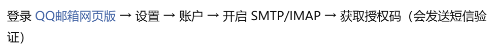


## 示例

发送邮件示例

```python
def send_mail(to,subject,template,**kwargs):
    # 创建邮件对象，第一个是标题，sender发件人，recipients收件人列表
    msg = Message(app.config['FLASKY_MAIL_SUBJECT_PREFIX']+subject,
                  sender=app.config['FLASKY_MAIL_SENDER'],recipients=[to])
    # 渲染文本和HTML内容
    msg.body=render_template(template+'.txt',**kwargs)
    msg.html=render_template(template+'.html',**kwargs)
    mail.send(msg)
```


## 异步发送

网页如果不使用异步发送邮件，那么调用mail.send()时会卡住直到邮件发送完成

```python
def send_async_email(app,msg):
    with app.app_context():
        mail.send(msg)

def send_email(to, subject, template, **kwargs):
    msg = Message(current_app.config['FLASKY_MAIL_SUBJECT_PREFIX'] + subject,
    sender=current_app.config['FLASKY_MAIL_SENDER'], recipients=[to])
    msg.body = render_template(template + '.txt', **kwargs)
    msg.html = render_template(template + '.html', **kwargs)
    # 使用多线程的时候需要_get_current_object()传入真正的实例对象
    tr=Thread(target=send_async_email,args=[current_app._get_current_object() ,msg])
    tr.start()
    return tr
```


# 项目结构

## 总体概览

```python
your_project/
│
├── app/
│   ├── __init__.py         # 应用工厂，注册蓝图和扩展
│   ├── models.py           # 数据库模型
│   ├── email.py            # 邮件发送逻辑（如果有）
│   ├── main/               # 一个蓝图（模块）
│   │   ├── __init__.py     # 注册蓝图
│   │   ├── views.py        # 路由和视图函数
│   │   ├── forms.py        # 表单
│   │   └── ...             # 其他
│   └── templates/          # HTML 模板（可子目录区分模块）
│   |    └── ...
|   |   
|   └── statics/            # 静态文件(CSS JS 图片 字体) 不需要服务器处理，由浏览器请求加载
│       └── ...
│
├── migrations/             # flask-migrate生成的迁移目录
│
├── config.py               # 配置文件（你已经写好的）
├── manage.py               # 启动入口（flask run / shell用它）
├── requirements.txt        # 项目依赖
└── README.md

```


## config.py

config.py是一个Python配置文件，用于集中管理应用程序的不同环境

```python
import os 

basedir=os.path.abspath(os.path.dirname(__file__))

# 配置基类
class Config:
    SECRET_KEY = os.environ.get('SECRET_KEY') or os.urandom(24)# 设置密钥，最好是固定的
    SQLALCHEMY_TRACK_MODIFICATIONS = False                     # 不追踪数据库修改


    '''邮件设置 以QQ邮件服务器为例'''
    MAIL_SERVER='smtp.qq.com'   # SMTP服务器
    MAIL_PORT=465
    MAIL_USE_SSL=True
    MAIL_USERNAME=os.environ.get('MAIL_USERNAME')  # 凑够环境变量中取得
    MAIL_PASSWORD=os.environ.get('MAIL_PASSWORD') 
    MAIL_DEFAULT_SENDER = '2228632512@qq.com'   # 默认发送者
    FLASKY_MAIL_SUBJECT_PREFIX = '[Flasky]' # 前缀
    FLASKY_MAIL_SENDER = 'Flasky Admin <2228632512@qq.com>' # 发送者


    '''数据库设置'''
    SQLALCHEMY_DATABASE_URI='sqlite:///' + os.path.join(basedir, 'data.sqlite')

    # 
    @staticmethod
    def init_app(app):
        """可选：在应用创建后执行额外的初始化"""
        pass  # 默认不执行任何操作
# 下面是几个子类

'''
开发环境，启用调试模式
'''
class DevelopmentConfig(Config):
    DEBUG = True  # 开启调试模式

'''
测试环境，使用内容数据库
'''
class TestingConfig(Config):
    TESTING = True  # 启用测试模式
    SQLALCHEMY_DATABASE_URI = 'sqlite:///:memory:'  # 使用内存数据库


'''
生产环境，关闭调试模式
'''
class ProductionConfig(Config):
    DEBUG = False  # 关闭调试模式

# 配置字典
config = {
 'development': DevelopmentConfig,
 'testing': TestingConfig,
 'production': ProductionConfig,
 'default': DevelopmentConfig
}
```


在主程序中加载配置

```python
from flask import Flask
from config import config  # 导入 config 字典

app = Flask(__name__)

app.config.from_object(config['default'])
```


## 应用包

应用包存放应用的所有代码，模板静态文件(templates，statics)

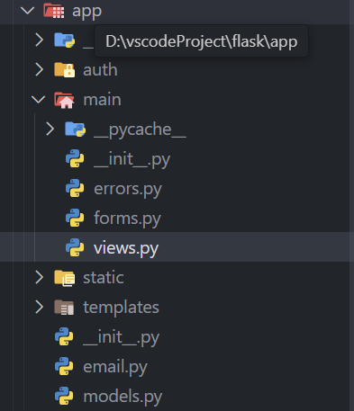

在单个文件中开发应用很方便，但是应用在全局作用域创建无法动态修改配置，而在测试中需要使用不同的配置，使用应用工厂函数可以延迟创建实例，在创建前自由修改配置

app.\__init__

```python
from flask import Flask,render_template
from flask_bootstrap import Bootstrap
from flask_mail import Mail
from flask_moment import Moment
from config import config
from flask_sqlalchemy import SQLAlchemy
from flask_migrate import Migrate

bootstrap=Bootstrap()
mail=Mail()
moment=Moment()
db=SQLAlchemy()
migrate=Migrate()

def create_app(config_name):
    app=Flask(__name__)
    app.config.from_object(config[config_name])
    config[config_name].init_app(app)

    bootstrap.init_app(app)
    mail.init_app(app)
    moment.init_app(app)
    db.init_app(app)
    migrate.init_app(app,db)
    '''
    添加路由和自定义的错误页面
    '''
    return app 
```


转换为应用工厂函数的操作让定义路由变得复杂了，在单脚本应用中，实例存在于全局作用域中，路由可以直接使用装饰器定义，但是用了应用工厂函数后，实例在运行时创建，只有在调用create_app后才能用装饰器定义路由，这样就太晚了。

而蓝图可以解决这个问题，蓝图定义的路由和错误处理程序处于休眠状态，等主程序调用 `create_app()` 时会把这些函数“注册”上去

主蓝本(app/main/\__init__.py)

```python
from flask import Blueprint

# 第一个参数是蓝图的名称，第二个参数是蓝图所在的包
main=Blueprint('main',__name__)

# 能把路由和错误处理程序与蓝图关联起来，但是要在最后导入防止循环依赖
from . import views,errors # 相对导入
```

主蓝图下的视图函数和错误处理程序

错误处理程序(app/main/errors.py)

```python
from flask import render_template
from . import main

@main.app_errorhandler(404)
def page_not_found(e):
    return render_template('404.html'),404


@main.app_errorhandler(500)
def internal_server_error(e):
    return render_template('500.html'),500
```


视图函数app/main/views.py，修改路由装饰器app.route->main.route，实例修改为app->current_app，url_for参数index->main.index即主蓝图的名称

```python
@main.route('/',methods=['GET','POST'])
def index():
    form=NameForm()
    if form.validate_on_submit():
        user = User.query.filter_by(username=form.name.data).first()
        if user is None:
            user = User(username=form.name.data)
            db.session.add(user)
            session['known'] = False
            if current_app.config['MAIL_USERNAME']:
                send_email(current_app.config['MAIL_USERNAME'], 'New User',
        'email', user=user)
        else:
            session['known']=True
        session['name']=form.name.data
        form.name.data=''
        return redirect(url_for('index'))
    return render_template('index.html',form=form,name=session.get('name'),current_time=datetime.now(timezone.utc))

```


注册主蓝本

```python
def create_app(config_name):
    app=Flask(__name__)
    app.config.from_object(config[config_name])
    config[config_name].init_app(app)

    bootstrap.init_app(app)
    mail.init_app(app)
    moment.init_app(app)
    db.init_app(app)

    '''
    添加路由和自定义的错误页面
    '''
    from .main import main as main_blueprint
    app.register_blueprint(main_blueprint)
    
    
    from .auth import auth as auth_blueprint    
	app.register_blueprint(auth_blueprint,url_prefix='/auth') # url_prefix给蓝图下的路由加上公共前缀
    return app 
```


## 实例

```python
import os
from app import create_app,db
from app.models import User,Role
from flask import Migrate

app=create_app('default')
migrate=Migrate()

@app.shell_context_processor
def make_shell_context():
    return dict(db=db,User=User,Role=Role)
```


## 生成需求文件

```python
 pip freeze >requirements.txt
```


# 用户身份验证


## 密码

保证密码的安全性关键不在于存储密码本身，而是存储密码的散列值，计算密码散列值的函数接受密码作为输入，添加随即内容之后使用多种单向加密算法转换密码，最终得到一个和原始密码没有关系的字符序列，且无法还原成原始密码，核对密码时再次计算散列值(因为转换函数是可以复现的)，这样就可以储存散列密码以代替原始密码。

使用Werkzeug扩展来实现

```python
pip install Werkzeug
```

重新定义模型，添加密码字段

```python
from  werkzeug.security import generate_password_hash,check_password_hash

class User(db.Model):
    __tablename__='User' # 表名
    id=db.Column(db.Integer,primary_key=True) # 属性
    username=db.Column(db.String(64),unique=True,index=True)
    password_hash=db.Column(db.String(128))
    # 创建外键引用 roles指的是表名
    role_id=db.Column(db.Integer,db.ForeignKey('roles.id'))

    # 用于表示对象的字符串方法
    def __repr__(self):
        return '<User %r>'%self.username
    
    '''
    @property装饰器将方法伪装为属性，当有人访问password时，会
    触发异常
    '''
    @property
    def password(self):
        raise AttributeError("password is not a readabel attribute")
    
    '''@password.setter与@property需成对出现 当有人设置password时调用此方法加密'''
    @password.setter
    def password(self,password):
        self.password_hash=generate_password_hash(password)

    def verify_password(self,password):
        return check_password_hash(self.password_hash,password)
    
```

## 验证身份

使用Flask-Login 扩展

```python
pip install flask-login
```


Flask-Login 需要应用中有User对象，且User模型必须实现以下的属性和方法

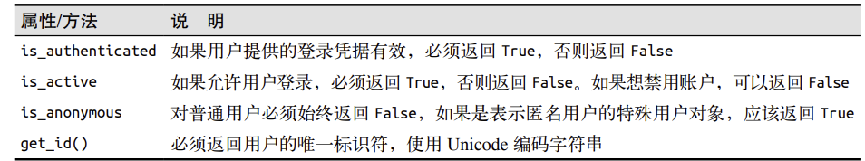


可以继承满足大部分需求

```python
from flask_login import UserMixin
class User(db.Model,UserMixin):
```


匿名用户尝试访问受保护的页面时，Flask-Login将重定向到登录页面

`app/__init__.py`

```python
from flask_login import LoginManager
login_manager = LoginManager()
login_manager.login_view = 'auth.login' # login由蓝图auth定义，所以要加上蓝图的名称
def create_app(config_name):
 # ...
 login_manager.init_app(app)
 # ...
```


Flask-Login需要指定一个函数用于获取用户信息

`app/models.py`

```python
from . import login_manager
@login_manager.user_loader
def load_user(user_id):
    return User.query.get(int(user_id))
```

## 保护路由

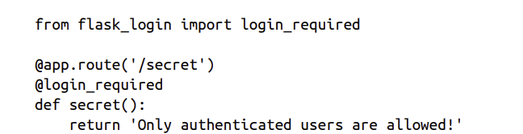

使用login_requeired装饰器的函数会判断current_ user.is_authenticated表达式的结果是否为 True

## 添加登录表单

```python
class LoginForm(FlaskForm):
    email=StringField('Email',validators=[DataRequired(),Length(1,64),Email()])
    password=PasswordField('Password',validators=[DataRequired()])
    remeber_me=BooleanField('Keep me logged in ')
    submit=SubmitField('Login in')
```


添加登入登出按钮， current_user是Flask-Login 定义的，模板中自动加载

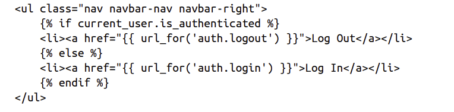

## 登录

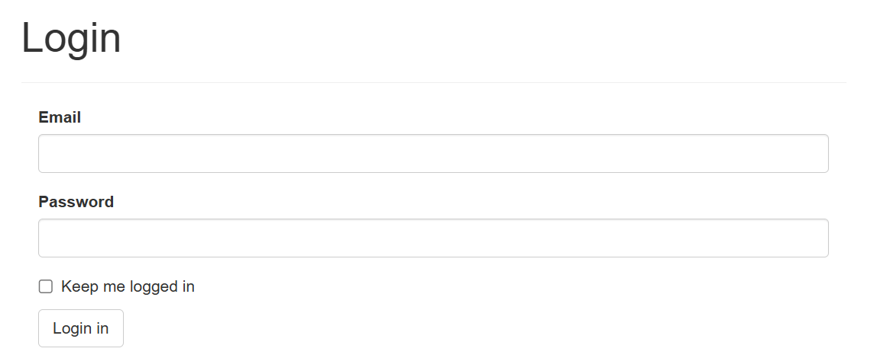

```python
@auth.route('/login',methods=['POST','GET'])
def login():
    form=LoginForm()
    # 是否有提交
    if form.validate_on_submit():
        # 查询
        user=User.query.filter_by(email=form.email.data).first()
        # 通过验证
        if user and user.verify_password(form.password.data):
            login_user(user) # 把用户信息储存到session,这样用户才能被识别登录状态
            # 用户访问未授权的URL时会显示登录表单，原URL会保存在next参数中
            next=request.args.get('next')
            # 不存在则重定向到首页
            if not next or next.startwith('/'):
                next=url_for('main.index')
            return redirect(next)
        flash('Invalid username or password')
    return render_template('auth/login.html',form=form)
```


## 登出

logout_user会删除并重设用户会话

```python
from flask_login import login_required,logout_user
@auth.route('/logout')
@login_required
def logout():
    logout_user()
    flash('you have logged out')
    return redirect(url_for('.main.index'))
```


## Flask-Login运行机制

提交表单调用Flask-Login的login_user()函数将用户ID以字符串形式写入到用户会话，之后会重定向到其他页面。

在其他页面渲染时会使用Flask-Login的current_user，首先会调用Flask-Login内部的_get_user() 函数找出用户，\_get_user() 检查用户会话中有没有用户ID，如果没有返回一个Flask-Login的AnonymousUser 实例，反之使用user_loader装饰器注册的函数传入用户ID，加载用户对象并返回。


## 注册表单

```python
from flask_wtf import FlaskForm
from wtforms import StringField,SubmitField,PasswordField,BooleanField
from wtforms.validators import DataRequired,Email,Length,Regexp,EqualTo
from wtforms import ValidationError
from ..models import User

class RegistrationForm(FlaskForm):
    # 邮箱
    email=StringField('Email',validators=[DataRequired(),Length(1,64),Email()])
    # 用户名，规定了字符组成
    username=StringField('Username',validators=[DataRequired(),Regexp('^[A-Za-z][A-Za-z._]*$'),0,'Usernames must have only letters, numbers, \
                                                dots or underscores'])
    # 密码有二次确认
    password=PasswordField('Password',validators=[DataRequired(),EqualTo('password2',\
        message='Passwords must match')])
    password2=PasswordField('Password2',validators=[DataRequired(),])
    submit=SubmitField('Register')

    # 验证函数 验证密码和邮箱是否已经被使用过
    def validate_email(self,field):
        if User.query.filter_by(email=field.data).first():
            raise ValidationError('Email already registered')
    
    def validate_username(self,field):
        if User.query.filter_by(username=field.data).first():
            raise ValidationError('Username already in use')
```


## 代理对象

```python
from flask_login import current_user
```

用于获取当前登录用户，如果用户已登录则返回User对象，反之返回匿名用户对象AnonymousUserMixin

| 属性/方法                       | 说明                                              |
| :------------------------------ | :------------------------------------------------ |
| `current_user.is_authenticated` | 如果用户已登录返回 `True`，否则返回 `False`。     |
| `current_user.is_active`        | 如果用户账户是活跃的（未被禁用）返回 `True`。     |
| `current_user.is_anonymous`     | 如果是匿名用户（未登录）返回 `True`。             |
| `current_user.get_id()`         | 返回用户的唯一标识（通常是 `id`），用于加载用户。 |


## 确认账户

通过邮件确认

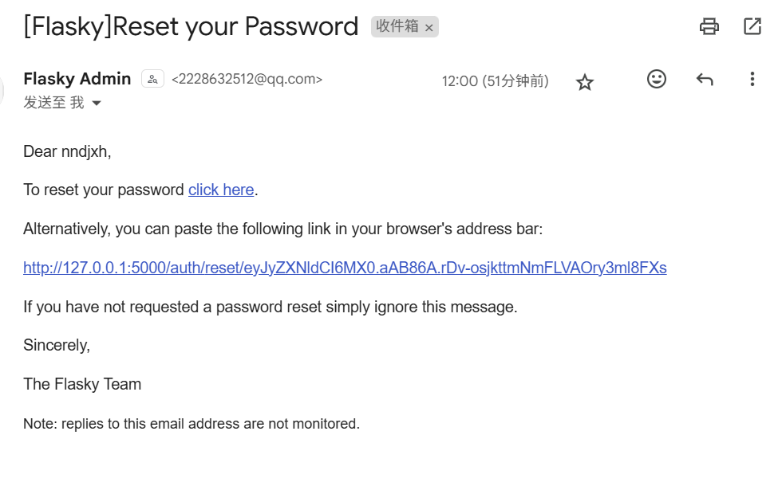

在模型中添加一个验证字段，模型中添加生成和检验令牌的方法

```python
from itsdangerous import URLSafeTimedSerializer as Serializer
class User(db.Model,UserMixin):
    confirmed=db.Column(db.Boolean,default=False)

    def generate_confirmation_token(self,expiration=3600):
        '''
        Serializer用于生成和验证加密令牌 secret_key密钥，salt盐值 防止生成相同的签名
        '''
        s=Serializer(current_app.config["SECRET_KEY"],'confirmation')
        # dumps接受要加密的数据，把用户的ID作为加密数据，返回字符串
        return s.dumps({'confirm':self.id})

    def confirm(self,token,max_age=3600):
        # 解密时，要用相同参数的Serializer
        s=Serializer(current_app.config["SECRET_KEY"],'confirmation')
        try:
            # loads接受令牌并检验令牌的有效性，max_age设置有效时间
            data=s.loads(token.encode('utf-8'),max_age=max_age)
        except Exception as e:
            print(e)
            return False
        # 不匹配
        print(data.get('confirm'))
        if data.get('confirm')!=self.id:
            return False
        # 修改确认字段
        self.confirmed=True
        db.session.add(self)
        return True 
```


注册视图函数

```python
@auth.route('/register',methods=['GET','POST'])
def register():
    form=RegistrationForm()
    if form.validate_on_submit():
        # 创建用户
        user=User(email=form.email.data,username=form.username.data,password=form.password.data)
        # 先提交，因为token需要用户的id
        db.session.add(user)
        db.session.commit()
        # 生成token
        token=user.generate_confirmation_token()
        # 发送确认邮件
        send_email(user.email,'Confirm you Accout','auth/email/confirm',user=user,token=token)
        flash('A confirmation email has been sent to you by email.')
        return redirect(url_for('auth.login'))
    return render_template('auth/register.html',form=form)
```


模板

url_for需要完整，且带上token

```html
<p>Dear {{ user.username }},</p>
<p>Welcome to <b>Flasky</b>!</p>
<p>To confirm your account please <a href="{{ url_for('auth.confirm', token=token, _external=True) }}">click here</a>.</p>
<p>Alternatively, you can paste the following link in your browser's address bar:</p>
<p>{{ url_for('auth.confirm', token=token, _external=True) }}</p>
<p>Sincerely,</p>
<p>The Flasky Team</p>
<p><small>Note: replies to this email address are not monitored.</small></p>
```


确认视图函数

```python
@auth.route('/confirm/<token>')
@login_required # 需要先登录(因为允许未确认的用户访问不重要的页面)
def confirm(token):
    # 如果已经确认过了，重定向
    if current_user.confirmed:
        return redirect(url_for('main.index'))
    # 成功确认，重定向
    if current_user.confirm(token):
        db.session.commit()
        flash('You have confirmed your account! Thanks')
    else:
        flash('The confirmation link is invlaid or has expired')
    return redirect(url_for('main.index'))
```


允许未确认的用户登录但只显示一个页面(unconfirmed)，使用生命周期钩子

```python
@auth.before_app_request
def before_request():
    # 已登录未确认，不在访问验证蓝图，也不是对静态文件的请求，则拦截
    if current_user.is_authenticated \
        and not current_user.confirmed \
        and request.blueprint != 'auth' \
        and request.endpoint != 'static':
        return redirect(url_for('auth.unconfirmed'))
```

未确认用户只能访问主页

```python
@auth.route('/unconfirmed')
def unconfirmed():
    if  current_user.is_anonymous or current_user.confirmed:
        return redirect(url_for('main.index'))
    return render_template('auth/unconfirmed.html')
```


重发确认邮件

```python
@auth.route('/confirm')
def resend_confirmation():
    token=current_user.generate_confirmation_token()
    send_email(current_user.email,'Confirm you Accout','auth/email/confirm',user=current_user,token=token)
    flash('A confirmation email has been sent to you by email.')
    return redirect(url_for('main.index'))
```


## 修改密码

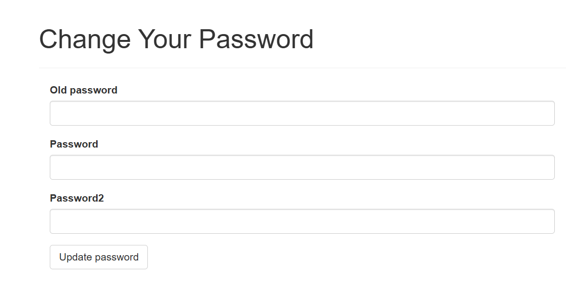

在auth下进行

```python
class ChangePasswordForm(FlaskForm):
    old_password=PasswordField('Old password',validators=[DataRequired()])
    password=PasswordField('Password',validators=[DataRequired(),EqualTo('password2',\
        message='Passwords must match')])
    password2=PasswordField('Password2',validators=[DataRequired(),])
    submit=SubmitField('Update password')

@auth.route('/change-password',methods=['POST','GET'])
@login_required
def change_password():
    # 表单
    form=ChangePasswordForm()
    if form.validate_on_submit():
        # 如果旧密码输入正确
        if current_user.verify_password(form.old_password.data):
            # 提交修改
            current_user.password=form.password.data
            db.session.add(current_user)
            db.session.commit()
            flash('Your password has been updated')
            return redirect(url_for('main.index'))
        else:
            flash('Invalid password')
    return render_template('auth/change_password.html',form=form)
```


## 重设密码

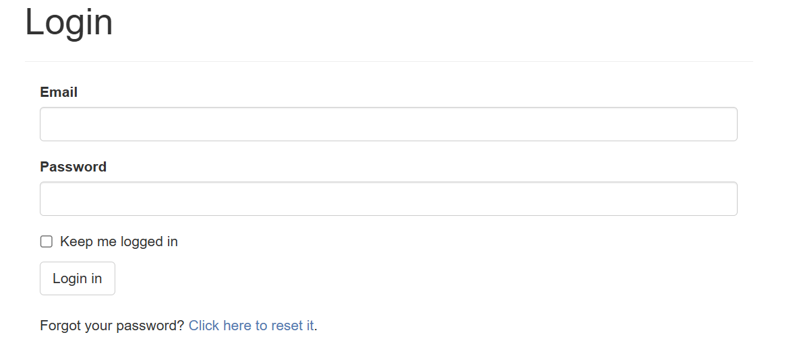

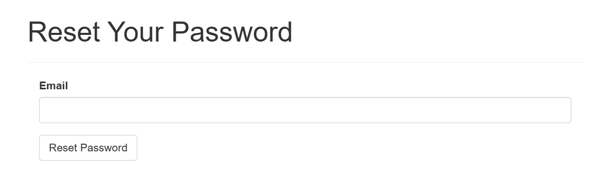

在登陆页面选择重设密码->password_reset_request处提交email，如果email存在会发送携带token的邮件->点击邮件链接，验证token，如果正确则重设密码，返回登陆页面。


token中带有用户的唯一id,，修改User模型

```python
class User(db.Model,UserMixin):
    ...
    def generate_reset_token(self):
        s=Serializer(current_app.config["SECRET_KEY"],'confirmation')
        return s.dumps({'reset':self.id})
    
    # 静态方法不依赖类的实例
    @staticmethod
    def reset_password(token,new_password,max_age=3600):
        s=Serializer(current_app.config["SECRET_KEY"],'confirmation')
        # 解密
        try:
            data=s.loads(token.encode('utf-8'),max_age=max_age)
        except:
            return False
        # get根据主键查找对象实例
        user=User.query.get(data.get('reset'))
        if not user:
            return False
        # 重设密码
        user.password=new_password
        db.session.add(user)
        return True 
```


两个表单，填写邮箱和新密码

```python
class PasswordResetRequestForm(FlaskForm):
    email=StringField('Email',validators=[DataRequired(),Length(1,64),Email()])
    submit = SubmitField('Reset Password')
class PasswordResetForm(FlaskForm):
    password=PasswordField('Password',validators=[DataRequired(),EqualTo('password2',\
        message='Passwords must match')])
    password2=PasswordField('Password2',validators=[DataRequired(),])
    submit=SubmitField('Reset Password')
```


视图函数

```python
@auth.route('/reset/<token>',methods=['POST','GET'])
def password_reset(token):
    # 已经登录不需要重设密码
    if not current_user.is_anonymous:
        return redirect(url_for('main.index'))
    form=PasswordResetForm()
    if form.validate_on_submit():
        # token通过验证，提交修改
        if User.reset_password(token, form.password.data):
            db.session.commit()
            flash('Your password has been updated.')
            return redirect(url_for('auth.login'))
        else:
            flash('Update fail ')
            return redirect(url_for('main.index'))
    return render_template('auth/reset_password.html',form=form)
```


## 邮箱修改

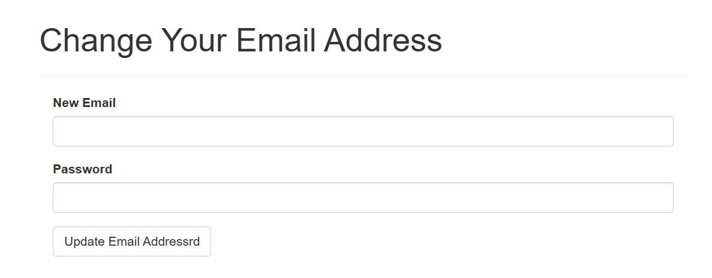

邮件修改在已经登陆的状态下进行，大致流程和修改密码差不多

对新地址要发送邮件确认，token中携带新邮件的地址，处于登录状态下(原地址)点击确认地址可以修改邮件地址

```python
class User(db.Model,UserMixin):   
    def generate_email_change_token(self,new_email):
        s=Serializer(current_app.config["SECRET_KEY"],'confirmation')
        # 携带新邮件的地址
        return s.dumps({'change_email':self.id,'new_email':new_email})
    def change_email(self,token):
        # 解密
        s=Serializer(current_app.config["SECRET_KEY"],'confirmation')
        try:
            data=s.loads(token.encode('utf-8'))
        except:
            return False
		#当前登录的用户不是要修改的用户
        if data.get('change_email')!=self.id:
            return False
        # 没有携带
        new_email=data.get('new_email')
        if not new_email:return False
	   # 新邮件地址已经存在
        if self.query.filter_by(email=new_email).first():return False
		
        # 修改
        self.email=new_email
        db.session.add(self)
        return True
```


添加表单

```python
class ChangeEmailForm(FlaskForm):
    email=StringField('New Email',validators=[DataRequired(),Length(1,64),Email()])
    password=PasswordField('Password',validators=[DataRequired()])
    submit = SubmitField('Update Email Addressrd')
	
    # 自定义验证方式
    def Validata_email(self,field):
        if User.query.filter_by(email=field.email.data).first():
            raise ValidationError('Email already registered.')
```


路由函数

```python
@auth.route('/change_email',methods=['POST','GET'])
@login_required
def change_email_request():
    form=ChangeEmailForm()
    # 填写表单
    if form.validate_on_submit():
        # 验证密码
        if current_user.verify_password(form.password.data):
            new_email=form.email.data
            # 生成token
            token=current_user.generate_email_change_token(new_email)
            # 发送邮件
            send_email(new_email,'Confirm your email address','auth/email/change_email',user=current_user,token=token)
            flash('An email with instructions to confirm your new email address has been sent to you.')
            return redirect(url_for('main.index'))
    else:
        flash('Invalid email or password.')
    return render_template('auth/change_email.html',form=form)


@auth.route('/change_email/<token>',methods=['POST','GET'])
@login_required
def change_email(token):
    # 验证并修改
    if current_user.change_email(token):
        db.session.commit()
        flash('You email address has been updated')
    else:
        flash('Invalid request')
    return redirect(url_for('main.index'))
```


# 用户角色

用户在数据库中需要分配不同的角色

## 模型

角色模型中用permission表示用户的权限

权限值设置2的幂次，这样权限在组合后的值仍是唯一的

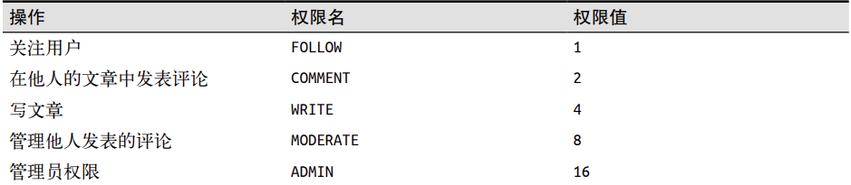

```python
class Permission:
    Follow=1
    COMMENT=2
    WRITE=4
    MODERATE=8
    ADMIN=16
```


```python
class Role(db.Model):
    ...
    # 是否是默认角色，只应有一个为True
    default=db.Column(db.Boolean,default=False,index=True)
    # 在定义时设置默认值，只有在添加到数据库后才会设置值，不方便做计算
    permissions=db.Column(db.Integer)
	
    def __init__(self,**kwargs):
        # 父类的构造函数
        super(Role,self).__init__(**kwargs)
        # 将权限的初始话放到构造函数中
        if not self.permissions:
            self.permissions=0
    ...
    
    def has_permission(self,perm):
        return self.permissions&perm==perm

    def add_permission(self,perm):
        if not self.has_permission(perm):
            self.permissions+=perm
    def remove_permission(self,perm):
        if self.has_permission(perm):
            self.permissions-=perm
    def reset_permission(self):
        self.permissions=0

    # 将预定义的角色及其权限写入到数据库，模型出现改动后，调用该方法更新橘色
    @staticmethod
    def insert_roles():
        roles={'User':[Permission.FOLLOW,Permission.COMMENT,Permission.WRITE ],
               'Moderator':[Permission.FOLLOW,Permission.COMMENT,Permission.WRITE,Permission.MODERATE],
               'Administrator':[Permission.FOLLOW,Permission.COMMENT,Permission.WRITE,Permission.MODERATE,Permission.ADMIN],
               }
        default_role='User'
        for r in roles:
            role=Role.query.filter_by(name=r).first()
            # 不存在则新建
            if not role:
                role=Role(name=r)
            role.reset_permission()
            for perm in roles[r]:
                role.add_permission(perm)
            # 将user设置为默认角色
            role.default=(role.name==default_role)
            db.session.add(role)
        db.session.commit()
```


## 赋予角色

管理员用户在注册时应该被赋予管理员权限，初始化时判断注册的邮箱是否在FLASKY_ADMIN中

```python
def __init__(self,**kwargs):
    super(User,self).__init__(**kwargs)
    if self.role is None:
        if self.email in current_app.config['FLASKY_ADMIN']:
            self.role=Role.query.filter_by(name='Administrator').first()
        else:
            self.role=Role.query.filter_by(default=True).first()
```


## 用户检验

需要经常检验用户是否拥有某项权限

```python
class User(UserMixin, db.Model):
     # ...
     def can(self, perm):
     return self.role is not None and self.role.has_permission(perm)
     def is_administrator(self):
     return self.can(Permission.ADMIN)
```


定义匿名用户类

```python
from flask_login import  AnonymousUserMixin
class AnonymousUser(AnonymousUserMixin):
    def can(self, permissions):
        return False
    def is_administrator(self):
        return False
login_manager.anonymous_user = AnonymousUser
```


想要让视图函数只对具有特定权限的用户开放，可以使用自定义的装饰器

`app/decorators.py`

```python
from functools import wraps
from flask import abort
from flask_login import current_user
from .models import Permission

# 权限装饰器，带参数的装饰器要用装饰器的装饰器
def permission_required(permission):
    def decorator(f):
        @wraps(f)
        def decorated_function(*args,**kwargs):
            if not current_user.can(permission):
                abort(403)
            return f(*args,**kwargs)
        return decorated_function
    return decorator

def admin_required(f):
    return permission_required(Permission.ADMIN)(f)
```


在视图函数上使用多个装饰器时应把route放在首位，剩下的装饰器按照视图函数的执行顺序排列

```python
@main.route('/moderate')
@login_required
@permission_required(Permission.MODERATE)
def for_moderators_only():
 return "For comment moderators!"
```


